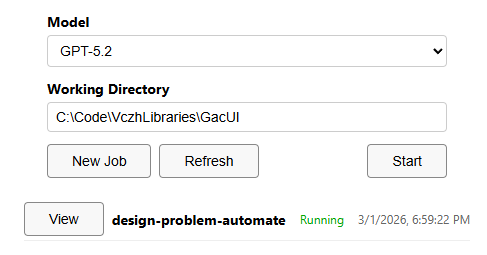
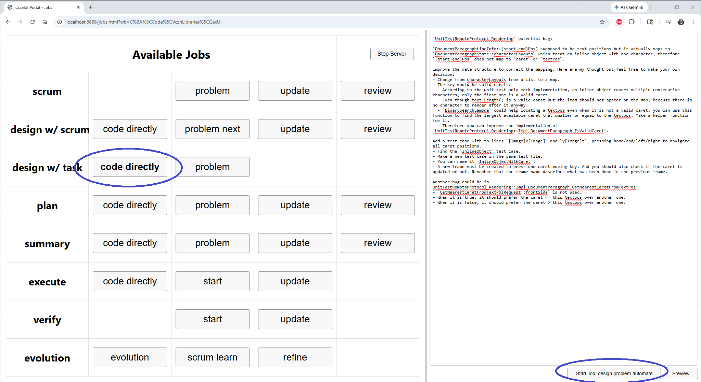
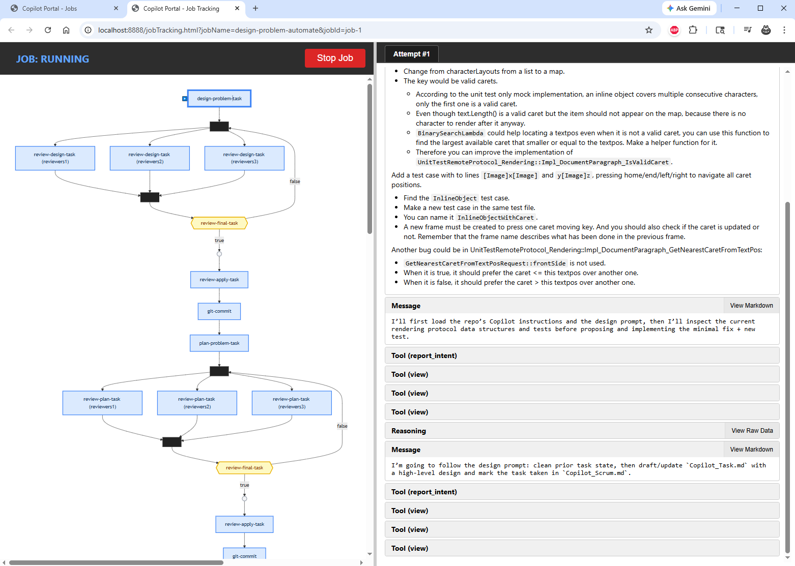

# .github/bot.ps1 (ALPHA VERSION)

- Run [bot.ps1](./bot.ps1) to start a bot.
- The default location would be the root of this repo.
  - You can change it to any repo.
  - Predefine jobs are designed for all prompts in `.github/prompts`.
  - For the current version, if you would like to design your own jobs, change [jobsData.ts](./Agent/packages/CopilotPortal/src/jobsData.ts), following [the instruction](./Agent/prompts/snapshot/CopilotPortal/JobsData.md).
- Click `New Job` to show all jobs.
- Select a job and finish your instruction.
- Launch and watch.
- You can inspect the job in different machines, but it is strongly recommended not to do this as it slower the server performance. It is not fully optimized yet.

## New Job

**NOTICE** `Model` here only affects the `Start` button which opens a chat session for a coding agent.
All jobs have multiple models assigned to complete different works in [jobsData.ts](./Agent/packages/CopilotPortal/src/jobsData.ts).

## Selection

## Launching

